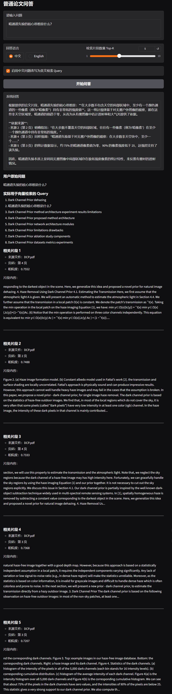
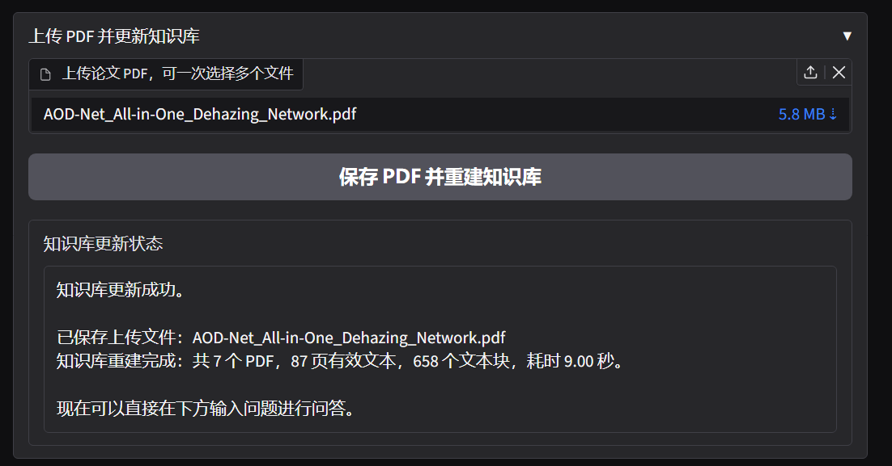
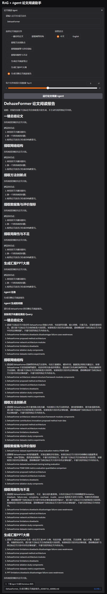
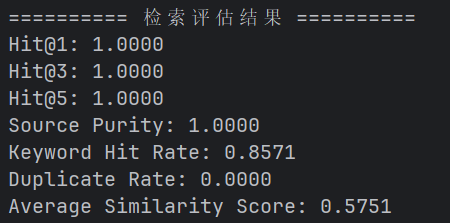

# Dehaze RAG Assistant

## 图像去雾论文 RAG + Agent 智能问答系统

本项目是一个面向 **图像去雾 / 图像恢复论文阅读场景** 的 RAG + Agent 智能问答系统。

系统支持论文 PDF 解析、文本清洗、滑动窗口分块、Embedding 向量化、FAISS 相似度检索、大模型生成回答、中文问题改写、上传 PDF 自动更新知识库，以及论文阅读 Agent 工作流。

用户可以通过 Gradio 页面完成：

- 上传图像去雾相关论文 PDF；
- 自动构建本地论文知识库；
- 使用中文或英文问题进行论文问答；
- 查看来源文件、页码、相似度和相关论文片段；
- 运行论文阅读 Agent，自动生成论文总结、网络结构、创新点、数据集与指标、局限性分析和汇报 PPT 大纲；
- 将 Agent 生成的论文阅读报告导出为 Markdown 文件；
- 使用评估脚本对检索效果进行量化评估。

---

## 项目展示

### 1. 系统首页


### 2. RAG 中文问答示例



### 3. 上传 PDF 并自动更新知识库



### 4. RAG + Agent 论文阅读报告



### 5. 检索评估结果



---

## 项目背景

在图像去雾、图像恢复等研究方向中，论文数量较多，方法结构、实验数据集、评价指标和模型对比信息分散在不同文献中。传统人工阅读方式效率较低，不利于快速定位关键信息。

因此，本项目围绕图像去雾论文阅读场景，构建一个轻量级 RAG + Agent 文献问答系统，用于辅助检索和整理：

- 论文方法与核心思想；
- 网络结构与模型创新点；
- 图像去雾常用数据集；
- PSNR、SSIM 等评价指标；
- 不同模型或方法之间的对比信息；
- 论文局限性与可借鉴之处；
- 论文汇报 PPT 大纲。

---

## 功能特性

- 支持批量解析 `papers/` 文件夹中的 PDF 论文；
- 支持网页上传 PDF，并自动保存到本地论文库；
- 支持 PDF 文本清洗，减少页眉、页脚、下载记录等噪声；
- 支持滑动窗口文本分块，并保留来源文件和页码信息；
- 使用 SentenceTransformers 生成文本 Embedding；
- 使用 FAISS 构建本地向量知识库；
- 支持中文问题自动改写为英文检索 Query；
- 支持多 Query 检索、Top-K 去重和片段重排；
- 支持论文级来源过滤，降低 Agent 报告串论文的风险；
- 接入阿里云百炼 deepseek-v4-pro 大模型 API；
- 支持基于检索片段生成中文或英文自然语言回答；
- 使用 Gradio 搭建可视化问答界面；
- 支持 RAG + Agent 论文阅读工作流；
- 支持 Agent 结果导出为 Markdown 报告；
- 提供小规模检索评估脚本，支持 Hit@K、Source Purity 等指标。

---

## 技术栈

| 模块 | 技术 |
|---|---|
| 编程语言 | Python |
| PDF 解析 | PyMuPDF |
| 文本清洗与分块 | 正则表达式、滑动窗口切分 |
| 文本向量化 | SentenceTransformers |
| 向量检索 | FAISS |
| 大模型 API | 阿里云百炼 deepseek-v4-pro |
| Web 界面 | Gradio |
| 项目管理 | Git、GitHub、PyCharm |
| 检索评估 | Hit@K、Source Purity、Keyword Hit Rate、Duplicate Rate |

---

## 系统流程

```text
论文 PDF
   ↓
PDF 文本解析
   ↓
文本清洗与滑动窗口分块
   ↓
SentenceTransformers 向量化
   ↓
FAISS 本地向量库
   ↓
用户输入问题
   ↓
中文问题改写为英文检索 Query
   ↓
多 Query 检索与 Top-K 重排
   ↓
论文级来源过滤
   ↓
大模型基于检索片段生成回答
   ↓
展示回答、来源文件、页码、相似度和相关片段
```

---

## Agent 工作流

论文阅读 Agent 将复杂论文阅读任务拆分为多个子任务：

```text
用户输入论文名 / 方法名
   ↓
选择论文阅读任务
   ↓
Agent 生成具体问题
   ↓
调用 RAG 检索目标论文片段
   ↓
大模型基于片段生成结构化回答
   ↓
输出论文总结 / 网络结构 / 创新点 / 数据集与指标 / 局限性 / PPT 大纲
```

支持的 Agent 任务包括：

- 一键总结论文；
- 提取网络结构；
- 提取方法创新点；
- 提取数据集与评价指标；
- 提取局限性与不足；
- 生成论文阅读笔记；
- 生成汇报 PPT 大纲；
- 生成完整论文阅读报告。

---

## 项目结构

```text
dehaze-rag-assistant/
│
├── papers/                         # 放置论文 PDF，PDF 不上传 GitHub
│   └── README.md
│
├── data/
│   ├── index/                       # 向量库文件，运行后自动生成
│   └── logs/                        # 日志文件
│
├── docs/
│   └── images/                      # 项目截图
│       ├── homepage.png
│       ├── demo_rag_answer.png
│       ├── demo_pdf_upload.png
│       ├── demo_agent_report.png
│       └── demo_eval_result.png
│
├── eval/
│   ├── eval_questions.json          # 检索评估问题集
│   └── evaluate_retrieval.py        # 检索评估脚本
│
├── src/
│   └── dehaze_rag/
│       ├── __init__.py
│       ├── config.py                # 全局配置
│       ├── pdf_loader.py            # PDF 文本解析
│       ├── text_splitter.py         # 文本清洗与分块
│       ├── embedding_model.py       # Embedding 模型封装
│       ├── vector_store.py          # FAISS 向量库封装
│       ├── llm_client.py            # 大模型 API 调用
│       ├── prompt_templates.py      # Prompt 模板
│       ├── build_index.py           # 构建知识库
│       ├── knowledge_base.py        # 上传 PDF 与重建知识库
│       ├── query_engine.py          # RAG 检索问答逻辑
│       ├── paper_agent.py           # 论文阅读 Agent
│       ├── report_exporter.py       # Markdown 报告导出
│       └── app.py                   # Gradio 网页界面
│
├── test_pdf_loader.py
├── test_dashscope_api.py
├── requirements.txt
├── pyproject.toml
├── .env.example
├── .gitignore
└── README.md
```

---

## 快速开始

### 1. 克隆项目

```bash
git clone https://github.com/nhao16650/dehaze-rag-assistant.git
cd dehaze-rag-assistant
```

### 2. 创建虚拟环境

```bash
python -m venv .venv
```

Windows PowerShell 激活虚拟环境：

```bash
.venv\Scripts\activate
```

### 3. 安装依赖

```bash
pip install -r requirements.txt
```

### 4. 安装当前项目

```bash
pip install -e .
```

这一步用于让 Python 正确识别 `src/dehaze_rag` 包，避免出现：

```text
ModuleNotFoundError: No module named 'dehaze_rag'
```

---

## 配置大模型 API

项目使用 `.env` 保存大模型 API 配置。  
请复制 `.env.example` 并新建 `.env`：

```bash
copy .env.example .env
```

`.env` 示例：

```env
LLM_API_URL=https://dashscope.aliyuncs.com/compatible-mode/v1/chat/completions
LLM_API_KEY=your-api-key-here
LLM_MODEL=deepseek-v4-pro

LLM_ENABLE_THINKING=true
LLM_REASONING_EFFORT=high

CLEAR_PROXY_FOR_GRADIO=0
```

注意：

- `.env` 中包含真实 API Key，不要上传 GitHub；
- `.env.example` 只保留配置模板，可以上传；
- 如果 Gradio 本地启动遇到 502，可尝试设置 `CLEAR_PROXY_FOR_GRADIO=1`。

---

## 使用方法

### 1. 放入论文 PDF

将图像去雾或图像恢复方向论文 PDF 放入：

```text
papers/
```

注意：论文 PDF 不建议上传到 GitHub，因此 `.gitignore` 默认忽略：

```text
papers/*.pdf
```

### 2. 构建向量知识库

```bash
python -m dehaze_rag.build_index
```

该命令会完成：

```text
读取 PDF
↓
解析文本
↓
文本清洗
↓
滑动窗口分块
↓
生成 Embedding
↓
构建 FAISS 向量索引
↓
保存向量库和文本块元数据
```

### 3. 启动 Gradio 网页界面

```bash
python -m dehaze_rag.app
```

启动成功后，终端会显示：

```text
Running on local URL: http://127.0.0.1:7861
```

浏览器打开该地址即可使用。

---

## 示例问题

普通 RAG 问答可测试：

```text
暗通道先验的核心思想是什么？
```

```text
GridFormer 是什么架构？
```

```text
PSNR 和 SSIM 是用来评价什么的？
```

```text
图像去雾常用的数据集有哪些？
```

Agent 论文阅读可测试：

```text
DCP
```

```text
GridFormer
```

---

## Evaluation

本项目提供小规模检索评估脚本，用于评估 RAG 检索质量。

运行：

```bash
python eval/evaluate_retrieval.py
```

评估指标包括：

| Metric | Description |
|---|---|
| Hit@1 / Hit@3 / Hit@5 | Top-K 中是否命中预期论文来源 |
| Source Purity | Top-K 中来自目标论文的片段比例 |
| Keyword Hit Rate | Top-K 片段中是否包含预期关键词 |
| Duplicate Rate | Top-K 结果中的重复片段比例 |
| Average Similarity Score | 平均相似度分数 |

当前小规模测试集结果：

| Metric | Value |
|---|---|
| Hit@1 | 1.0000 |
| Hit@3 | 1.0000 |
| Hit@5 | 1.0000 |
| Source Purity | 1.0000 |
| Keyword Hit Rate | 0.8571 |
| Duplicate Rate | 0.0000 |
| Average Similarity Score | 0.5648 |

说明：该结果基于当前本地论文知识库和 7 条手工构建的测试问题，仅用于展示系统检索效果。

---

## 当前版本效果

当前版本已经实现：

- PDF 文本解析；
- 文本清洗与滑动窗口分块；
- Embedding 向量化；
- FAISS 本地向量检索；
- 中文问题改写为英文检索 Query；
- 大模型基于检索片段生成回答；
- Top-K 相关论文片段返回；
- 来源文件、页码、相似度展示；
- 上传 PDF 自动重建知识库；
- RAG + Agent 论文阅读助手；
- Markdown 报告导出；
- 检索效果评估。

---

## 后续优化方向

- 增加更多论文和更大规模评估集；
- 支持多语言 Embedding 模型；
- 增加更细粒度的论文结构化抽取；
- 增加对话历史与多轮追问能力；
- 支持将 Agent 报告导出为 Word / PDF；
- 增加 Dify 版本知识库问答应用；
- 增加前端页面美化与部署支持。

---

## 简历描述参考

本项目可在简历中描述为：

```text
面向图像去雾文献阅读的 RAG + Agent 智能问答系统

1. 基于 PyMuPDF、SentenceTransformers、FAISS 和 Gradio 实现图像去雾论文 RAG 问答系统，支持 PDF 解析、文本清洗、滑动窗口分块、向量化检索和来源页码展示。
2. 接入阿里云百炼 deepseek-v4-pro 大模型 API，实现“用户提问—多 Query 检索—Top-K 片段重排—上下文增强—大模型生成回答”的完整 RAG 流程。
3. 支持中文问题自动改写为英文检索 Query，提高英文论文场景下的中文问答检索效果。
4. 支持用户在 Gradio 页面上传论文 PDF，并自动完成文本解析、分块、Embedding 生成和 FAISS 知识库重建。
5. 设计论文阅读 Agent 工作流，支持论文总结、网络结构提取、创新点提取、数据集与指标整理、局限性分析和汇报 PPT 大纲生成。
6. 引入论文级来源过滤、Top-K 去重和小规模检索评估机制，从 Hit@K、Source Purity、Keyword Hit Rate 和 Duplicate Rate 等指标评估检索效果。
```

---

## Notes

- 本项目不会上传论文 PDF 文件，用户需要自行将论文放入 `papers/` 文件夹；
- 本项目不会上传本地生成的向量库文件，用户可通过 `python -m dehaze_rag.build_index` 重新生成；
- 如果接入大模型 API，请勿将 API Key 写入代码或上传到 GitHub；
- `reports/` 和 `eval_results/` 为本地生成目录，默认不上传。

---

## License

This project is for academic learning and internship portfolio demonstration.