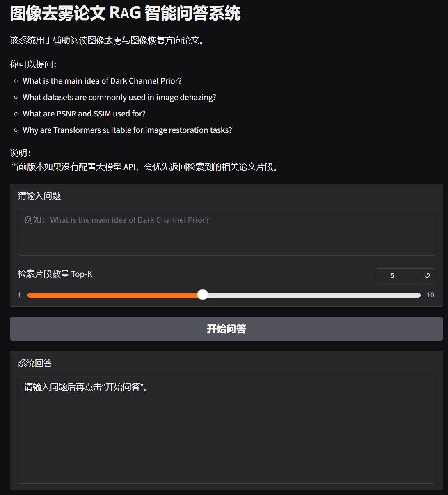

# Dehaze RAG Assistant

## 图像去雾论文 RAG 智能问答系统

本项目是一个面向图像去雾与图像恢复论文阅读场景的 RAG（Retrieval-Augmented Generation）智能问答系统原型。系统支持对论文 PDF 进行文本解析、文本清洗、滑动窗口分块、Embedding 向量化、FAISS 相似度检索，并通过 Gradio 提供可视化问答界面。

当前版本主要实现“论文检索问答”功能：用户输入问题后，系统会从本地论文知识库中检索最相关的论文片段，并返回来源文件、页码、相似度和片段内容。

> 当前版本如未配置大模型 API，会优先返回检索到的相关论文片段。后续可扩展为“检索片段 + 大模型生成回答”的完整 RAG 问答流程。

---

## 1. 项目背景

在图像去雾、图像恢复等研究方向中，论文数量较多，方法结构、实验数据集和评价指标分散在不同文献中。传统人工阅读方式效率较低，不利于快速定位论文中的关键信息。

因此，本项目围绕图像去雾论文阅读场景，构建一个轻量级 RAG 文献问答系统，用于辅助检索：

- 论文方法与核心思想
- 网络结构与模型创新点
- 实验数据集
- PSNR、SSIM 等评价指标
- 不同方法之间的对比信息

---

## 2. 功能特性

- 支持批量解析 `papers/` 文件夹中的 PDF 论文
- 支持 PDF 文本清洗，减少页眉、页脚、下载记录等噪声
- 支持滑动窗口文本分块，并保留来源文件和页码信息
- 使用 SentenceTransformers 生成文本 Embedding
- 使用 FAISS 构建本地向量知识库
- 支持用户问题向量化与 Top-K 相似片段检索
- 支持返回来源文件、页码、相似度和相关论文片段
- 使用 Gradio 搭建可视化问答界面
- 支持后续接入大模型 API，实现自然语言总结回答

---

## 3. 技术栈

| 模块 | 技术 |
|---|---|
| 编程语言 | Python |
| PDF 解析 | PyMuPDF |
| 文本向量化 | SentenceTransformers |
| 向量检索 | FAISS |
| 数值计算 | NumPy |
| Web 界面 | Gradio |
| 项目管理 | PyCharm / Git / GitHub |

---

## 4. 项目结构

```text
dehaze-rag-assistant/
│
├── papers/                         # 放置论文 PDF，PDF 不上传 GitHub
│   └── README.md
│
├── data/
│   ├── index/                       # 向量库文件，运行后自动生成
│   └── logs/                        # 日志文件
│
├── docs/
│   └── images/                      # 项目截图
│       ├── homepage.png
│       └── demo_result.png
│
├── src/
│   └── dehaze_rag/
│       ├── __init__.py
│       ├── config.py                # 全局配置
│       ├── pdf_loader.py            # PDF 文本解析
│       ├── text_splitter.py         # 文本清洗与分块
│       ├── embedding_model.py       # Embedding 模型封装
│       ├── vector_store.py          # FAISS 向量库封装
│       ├── llm_client.py            # 大模型回答接口，可选
│       ├── build_index.py           # 构建知识库
│       ├── query_engine.py          # 检索问答逻辑
│       └── app.py                   # Gradio 网页界面
│
├── test_pdf_loader.py               # PDF 解析测试脚本
├── requirements.txt                 # 项目依赖
├── pyproject.toml                   # 项目安装配置
├── .gitignore
└── README.md
```

---

## 5. 快速开始

### 5.1 创建虚拟环境

```bash
python -m venv .venv
```

Windows PowerShell 激活虚拟环境：

```bash
.venv\Scripts\activate
```

---

### 5.2 安装依赖

```bash
pip install -r requirements.txt
```

---

### 5.3 安装当前项目

```bash
pip install -e .
```

这一步用于让 Python 正确识别 `src/dehaze_rag` 包，避免出现：

```text
ModuleNotFoundError: No module named 'dehaze_rag'
```

---

### 5.4 放入论文 PDF

将图像去雾或图像恢复方向论文 PDF 放入：

```text
papers/
```

示例：

```text
papers/
├── DCP.pdf
├── Vision Transformers for Single Image Dehazing.pdf
└── MB-TaylorFormer.pdf
```

注意：论文 PDF 不建议上传到 GitHub，因此 `.gitignore` 中默认忽略了 `papers/*.pdf`。

---

### 5.5 测试 PDF 解析

```bash
python test_pdf_loader.py
```

如果成功，会显示类似：

```text
PDF 解析成功！共读取到 xx 页有效文本。
```

---

### 5.6 构建向量知识库

```bash
python -m dehaze_rag.build_index
```

该命令会依次完成：

```text
读取 PDF
↓
解析文本
↓
清洗文本
↓
滑动窗口分块
↓
生成 Embedding
↓
构建 FAISS 向量索引
↓
保存向量库和文本块元数据
```

成功后会在 `data/index/` 下生成：

```text
embeddings.npy
chunks.json
dehaze_faiss.index
```

---

### 5.7 命令行问答测试

```bash
python -m dehaze_rag.query_engine
```

示例问题：

```text
What is the main idea of Dark Channel Prior?
```

```text
What datasets are commonly used in image dehazing?
```

```text
What are PSNR and SSIM used for?
```

---

### 5.8 启动 Gradio 网页界面

```bash
python -m dehaze_rag.app
```

启动成功后，终端会显示：

```text
Running on local URL: http://127.0.0.1:7861
```

在浏览器中打开该地址即可使用网页问答界面。

---

## 6. 页面展示

### 首页界面

如果你已经保存截图，可以放在：

```text
docs/images/homepage.png
```

然后在这里显示：

```markdown

```

### 问答结果示例

```markdown

```

---

## 7. 示例问题

当前系统更适合使用英文问题检索英文论文，例如：

```text
What is the main idea of Dark Channel Prior?
```

```text
What datasets are commonly used in image dehazing?
```

```text
What are PSNR and SSIM used for?
```

```text
Why are Transformers suitable for image restoration tasks?
```

如果需要更好地支持中文问题检索英文论文，可以将 Embedding 模型替换为多语言模型，例如：

```python
sentence-transformers/paraphrase-multilingual-MiniLM-L12-v2
```

---

## 8. 当前版本效果

当前版本已经实现：

- PDF 文本解析
- 文本清洗与分块
- Embedding 向量化
- FAISS 本地向量检索
- Top-K 相关论文片段返回
- 来源文件、页码、相似度展示
- Gradio 可视化界面

当前版本暂未强制接入大模型 API，因此默认返回检索结果摘要和相关论文片段。

---

## 9. 后续优化方向

- 接入 DeepSeek、通义千问或 OpenAI 兼容 API，实现自然语言总结回答
- 增加中文问题支持，使用多语言 Embedding 模型
- 优化文本切分策略，避免片段从句子中间开始
- 增加 PDF 上传功能
- 增加对话历史与多轮问答能力
- 增加 Agent 式论文阅读流程，例如自动总结研究问题、方法创新点、数据集和评价指标
- 增加 Dify 版本知识库问答应用
- 增加测试样例和检索效果评估表

---

## 10. 项目运行截图

建议在 GitHub 上传前添加两张截图：

```text
docs/images/homepage.png
docs/images/demo_result.png
```

然后取消下面两行注释：

<!--


-->

---

## 11. 简历描述参考

本项目可在简历中描述为：

```text
面向图像去雾文献阅读的 RAG 智能问答系统

1. 围绕图像去雾论文阅读场景，设计并实现基于 RAG 的文献检索问答原型，用于辅助检索论文方法、实验数据集、评价指标和模型创新点。
2. 使用 PyMuPDF 完成论文 PDF 文本解析，并进行文本清洗、滑动窗口分块和元数据管理。
3. 使用 SentenceTransformers 对论文文本片段进行向量化表示，并基于 FAISS 构建本地向量知识库。
4. 实现“用户提问—相似片段检索—来源片段返回”的检索流程，支持返回相关论文片段、来源文件、页码和相似度分数。
5. 使用 Gradio 搭建可视化问答界面，针对 DCP、Transformer 去雾方法、数据集和评价指标等问题设计测试样例，验证系统检索效果。
```

---

## 12. License

This project is for academic learning and internship portfolio demonstration.
